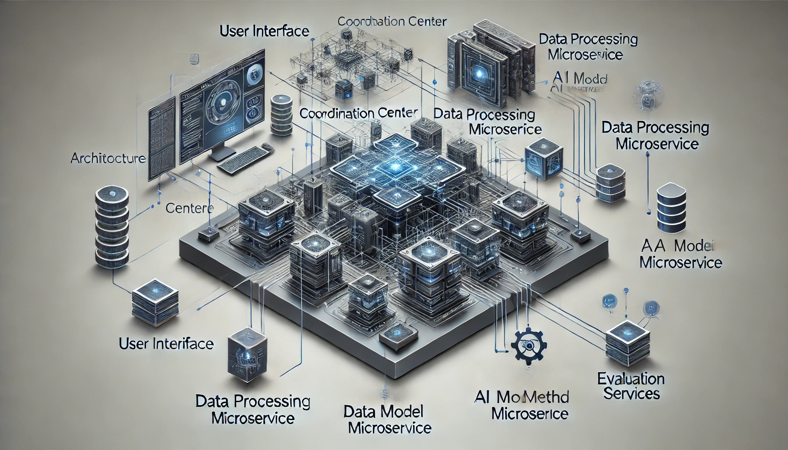

# XAIport

## Overview

XAIport is designed to deliver interpretable AI model predictions through a microservice architecture, allowing users to understand the underlying decision-making processes of AI models better. The architecture includes a User Interface, Coordination Center, Core Microservices such as Data Processing, AI Model, XAI Method, and Evaluation Services, along with a Data Persistence layer.





## Initial Setup

### Prerequisites

- Python 3.8 or later
- FastAPI
- httpx
- uvicorn
- Dependencies as listed in `requirements_fixed.txt`

### Installation Guide

1. **Environment Setup**:
   Ensure Python is installed on your system. It's recommended to use a virtual environment for Python projects:

   ```bash
   python -m venv venv
   source venv/bin/activate  # On Windows use `venv\Scripts\activate`
   ```

2. **Install Dependencies**:
   Install the necessary Python libraries with pip:

   ```bash
   pip install -r requirements_fixed.txt
   ```

3. **Clone the Repository**:
   Clone the repository to get the latest codebase:

   ```bash
   git clone https://github.com/DeepKondal/VideoXAI.git
   cd XAIport
   ```

### Configuration
Before running the system, configure all necessary details such as API endpoints, database connections, and service-related configurations using a JSON file. Adjust the config.json file based on the task—either for VBAD (Targeted/Untargeted) or Adversarial (FGSM) attacks.

Example `config.json` for VBAD attacks:

```json
{
  "upload_config": {
    "server_url": "http://127.0.0.1:8001",
    "datasets": {
      "kinetics_400": {
        "local_video_dir": "dataprocess/raw_videos"
      }
    }
  },
 "perturbation_config": {
  "servers": {
    "vbad_targeted": "http://127.0.0.1:8007",
    "vbad_untargeted": "http://127.0.0.1:8006"
  }
  },
  "model_config": {
    "base_urls": [
      "http://127.0.0.1:8010",
      "http://127.0.0.1:8011"
    ],
    "models": {
      "kinetics_video": {
        "model_name": "facebook/timesformer-base-finetuned-k400",
        "targeted_dir": "untargeted/final_perturbed_videos/targeted",
        "untargeted_dir": "untargeted/final_perturbed_videos/untargeted",
        "num_frames": 8
      }
    }
  },
  "xai_config": {
    "base_url": "http://127.0.0.1:8003",
    "datasets": {
      "kinetics_video": {
        "targeted_path": "untargeted/final_perturbed_videos/targeted",
        "untargeted_path": "untargeted/final_perturbed_videos/untargeted",
        "num_frames": 8
      }
    }
  }
}

```
config.json for adversarial file 
``` json
{
  "upload_config": {
    "server_url": "http://127.0.0.1:8001",
    "datasets": {
      "kinetics_400": {
        "local_video_dir": "dataprocess/videos"
      }
    }
  },
  "perturbation_config": {
    "server_url": "http://127.0.0.1:8001",
    "datasets": {
      "kinetics_400": {
        "perturbation_type": "adversarial_attack",
        "severity": 1,
        "video_directory": "dataprocess/videos"
      }
    }
  },
  "model_config": {
    "base_urls": [
      "http://127.0.0.1:8002",
      "http://127.0.0.1:8005"
    ],
    "models": {
      "kinetics_video": {
        "model_name": "facebook/timesformer-base-finetuned-k400",
        "original_video_dir": "dataprocess/videos",
        "adversarial_video_dir": "dataprocess/FGSM",
        "num_frames": 8
      }
    }
  },
  "xai_config": {
    "base_url": "http://127.0.0.1:8003",
    "datasets": {
      "kinetics_video": {
        "video_path": "dataprocess/videos",
        "adversarial_video_path": "dataprocess/FGSM",
        "num_frames": 8
      }
    }
  }
}

```
##  Required Servers to Run the VBAD Pipeline
Start the following services before executing the pipeline:
```
python dataprocess/dataprocess_server.py
python modelserver_untargeted/model_server.py
python modelserver_targeted/model_server.py
python untargeted/untargeted_server.py
python targeted/targeted_server.py
python xaiserver/xai_server.py
python center_server.py
```
## For FGSM Pipeline 
```
python dataprocess/dataprocess_server.py
python modelserver/model_server.py
python modelserver_adversarial/model_server.py
python xaiserver/xai_server.py
python center_server.py
```
### Starting the Service

### Using the API

- **Execute XAI Task**:

  ```bash
  curl -X POST "http://127.0.0.1:8880/run_pipeline/" \
  -H "Content-Type: application/json" \
  --data-binary "@task_sheets/task.json"
  ```

##  Outputs (videos, attention values) will be stored in the `output/` directory. 
